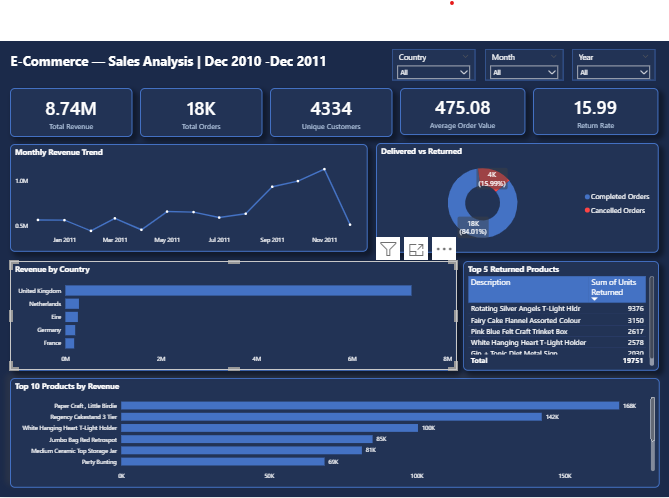

# E-Commerce Sales Analysis
**Tools:** Python | PostgreSQL | Power BI | Microsoft Word  
**Dataset:** UCI Online Retail Dataset — 541,910 transactions  
**Period:** December 2010 – December 2011  

---

## Project Overview
End-to-end data analysis of a UK-based online retail store covering 
data cleaning, exploratory data analysis, SQL querying, interactive 
dashboard development, and a formal business report with actionable 
recommendations.

The raw dataset contained 541,910 transactions which were cleaned down 
to 392,692 valid completed transactions — removing null CustomerIDs, 
cancellations, duplicates, and invalid entries.

---

## Dashboard Preview

---

## Key Findings
1. Revenue peaked in **November 2011 at £1,137,634** — more than 
   double the February low of £442,493, indicating heavy Q4 dependency
2. **Paper Craft, Little Birdie** ranks 1st by both revenue (£168,469) 
   and quantity sold (80,995 units) — the single most important SKU
3. Only **4 Champion customers** exist across 4,334 — 34.7% of 
   customers never returned after their first purchase
4. **UK market accounts for 82.9% of revenue** — geographic 
   concentration represents a significant business risk
5. **Return rate of 15.99%** significantly exceeds the retail industry 
   average of 8–10%
online-retail-sales-analysis/
│
├── notebooks/
│   ├── 01_data_cleaning.ipynb
│   └── 02_eda_analysis.ipynb
│
├── sql/
│   ├── 00_create_tables.sql
│   └── 02_eda_analysis.sql
│
├── dashboard/
│   └── online_retail_dashboard.pbix
│
├── images/
│   └── dashboard_screenshot.png
│
└── report/
└── RetailCo_Sales_Report.docx
> **Note:** The `data/` folder is not included in this repository.
> Both the raw dataset (`online_retail.csv` at 47MB) and the cleaned 
> dataset (`online_retail_cleaned.csv`) exceed GitHub's 25MB file size 
> limit. See the Dataset section below for download instructions.

---

## Dataset
The raw and cleaned datasets are not included in this repository as 
both exceed GitHub's 25MB file size limit.

**To run this project:**
1. Download the raw dataset directly from the UCI Machine Learning 
   Repository:  
   [UCI Online Retail Dataset](https://archive.ics.uci.edu/dataset/352/online+retail)
2. Place the downloaded file in the same folder as the notebooks
3. Rename it to `online_retail.csv`
4. Run `01_data_cleaning.ipynb` to generate the cleaned files:
   - `online_retail_cleaned.csv`
   - `online_retail_cancelled.csv`
5. All subsequent notebooks and SQL files use the cleaned output

---

## How to Run
1. Download the raw dataset from the UCI link above
2. Run `01_data_cleaning.ipynb` to clean the raw dataset
3. Import `online_retail_cleaned.csv` into PostgreSQL
4. Run `00_create_tables.sql` to create the database tables
5. Run `02_eda_analysis.sql` to execute the SQL analysis
6. Open `online_retail_dashboard.pbix` in Power BI Desktop

---

## Tools Used
- **Python** — Pandas, Matplotlib, Seaborn
- **PostgreSQL** — EDA queries, RFM segmentation, return rate analysis
- **Power BI** — Interactive sales dashboard
- **Microsoft Word** — Formal business report with recommendations

---

## Key Performance Indicators

| Metric | Value |
|---|---|
| Total Revenue | £8.74M |
| Total Orders | 18,405 |
| Unique Customers | 4,334 |
| Average Order Value | £475.08 |
| Return Rate | 15.99% |

---

## Author
**Okunowo Oluwademilade David**  
[LinkedIn](www.linkedin.com/in/oluwademilade-okunowo-2b22823bb) | [GitHub](https://github.com/demilade-david)
---
